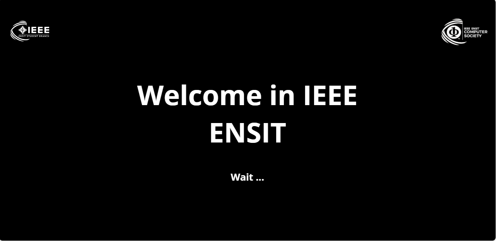
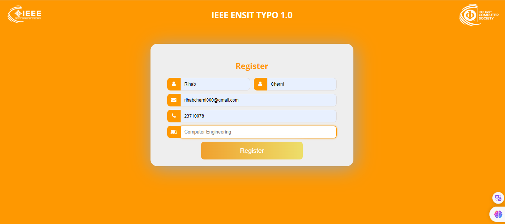
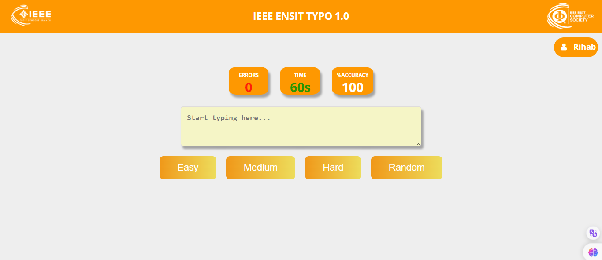
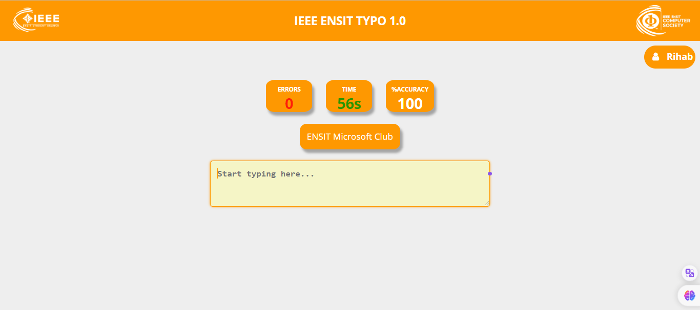
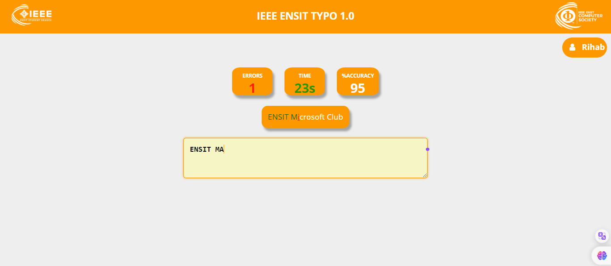
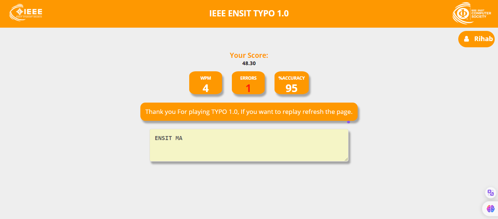

# Typing Game - IEEE ENSIT

This project is a simple typing game developed for IEEE ENSIT using HTML, CSS, JavaScript, PHP, and a CSV file to store player data.

## Features

- **User Registration:**
  - Collects user information such as first name, last name, email, phone number, and engineering field through a registration form.

- **Server-side Data Storage:**
  - Utilizes a PHP script to handle form submissions, storing player data in a CSV file (`players.csv`).

- **Game Display:**
  - After successful registration, the game interface is displayed, and the user's first name is shown.

## Technologies Used

- **Frontend:**
  - HTML
  - CSS
  - JavaScript

- **Backend:**
  - PHP

## How to Run the Project

1. **Setup Local Server:**
   - Make sure you have a local server environment set up (e.g., XAMPP, WampServer).

2. **Clone the Repository:**
   git clone https://github.com/rihabcherni/Typing-Game-IEEE-ENSIT.git
   cd typing-game-ieee-ensit

3. **Place Project in Server Directory:**
Move the project files to the appropriate directory within your local server's document root.

4. **Start Local Server**

5. **Access the Game:**
Open your web browser and navigate to http://localhost/Typing-Game-IEEE-ENSIT/index.html.

## Contributors
Cherni Rihab

